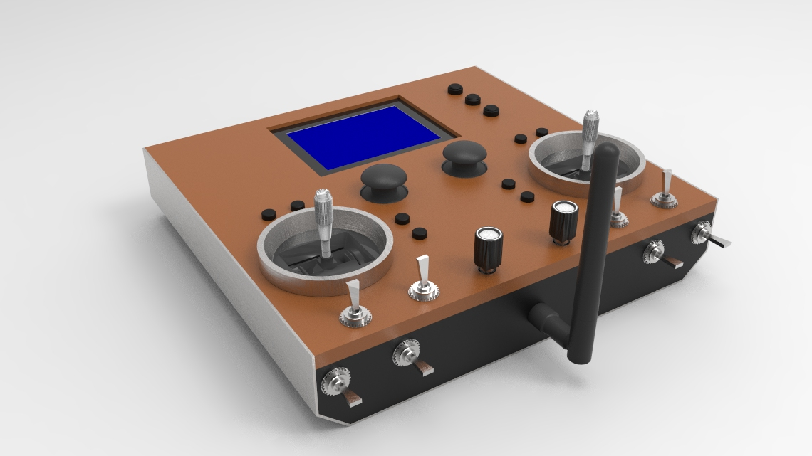
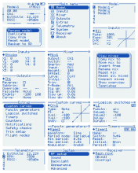
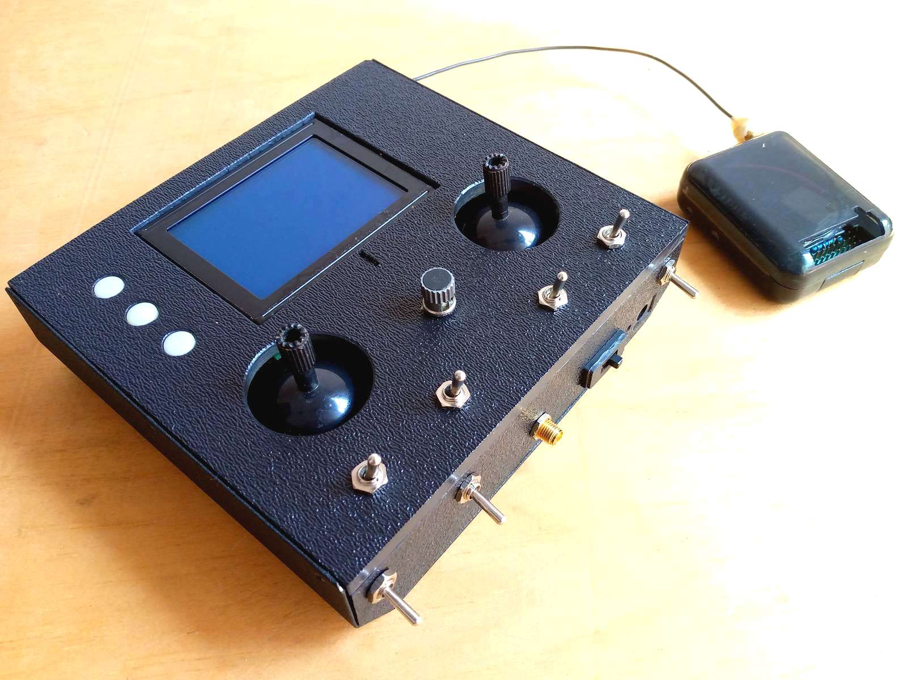
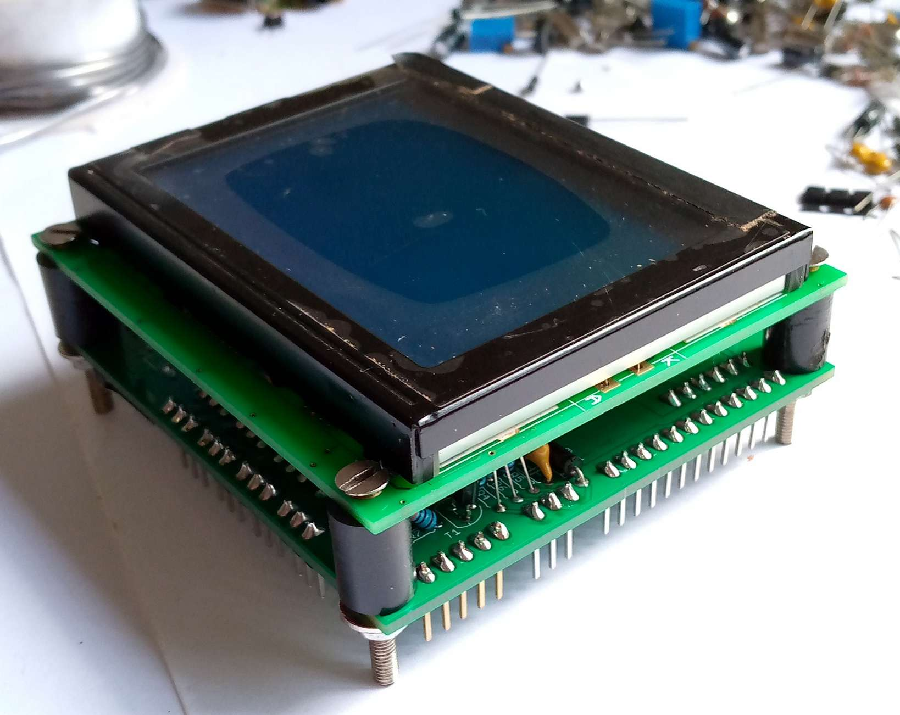
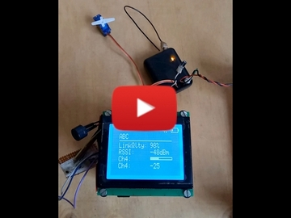

# FreeTX
Open source radio control system for almost anything.  
Remotely operate model airplanes, multicopters, helicopters, boats, land vehicles, robots, animatronics, etc.

## Main features
- 20 fully proportional RC channels, each encoded with 10 bits.
- Configurable RC channel output signal format.
- Update rate of 50x per second for all RC channels.
- Receiver binding, Adjustable RF power, Frequency hopping.
- Reverse, subtrim, endpoints, failsafe.
- Dual rates and expo, Custom curves, Flight modes.
- Powerful mixer system, Logical switches, Function generators, Counters, Timers.
- Custom telemetry, Alarms, Warnings, Notifications, etc.
- Intuitive user interface.
- Model memory. I2C eeprom and SD card supported.
- Model types, context-aware nomenclature.

## Hardware and Schematics
The transmiter and receiver schematics can be found in the 'schematics' folder. 
The major components are
- 1x Atmega2560 microcontroller, 2x Atmega328p microcontrollers.
- 2x SX1276/77/78/79 or RFM95 based Lora modules. Other RF modules can possibly be used with some modifications to the source code.
- 128x64 KS0108 based LCD. Any 128x64 LCD can however be used (provide own driver code).

## User Interface
Three buttons are used for navigation; Up, Select, Down. Long press Select to go Back.

## Quick guide
[Mixer](doc/mixer.md)
 [Custom curves](doc/custom_curves.md)
 [Logical switches](doc/logical_switches.md)
 [Telemetry](doc/telemetry.md)
 [Receiver binding and configuration](doc/receiver_config.md)

## Gallery

 

## Frequently Asked Questions
[Got a question? See the FAQ first.](doc/faq.md)
