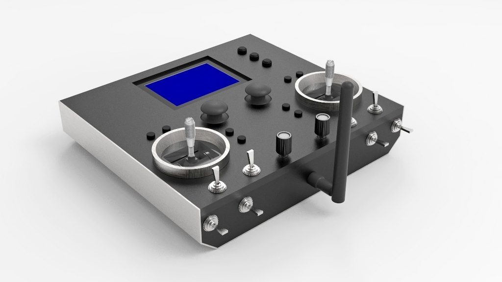

# FreeTX
Open source radio control system for almost anything.  
Remotely operate model airplanes, multicopters, helicopters, boats, land vehicles, robots, animatronics, etc.

## Main features
- 20 fully proportional RC channels, each encoded with 10 bits.
- Configurable RC channel output signal format.
- Update rate of 50x per second for all RC channels.
- Receiver binding, adjustable RF power, frequency hopping.
- Reverse, subtrim, endpoints, failsafe, dual rates and expo, custom curves, flight modes.
- Powerful mixer system, logical switches, function generators, counters, timers.
- Telemetry, alarms, warnings, notifications, home screen widgets.
- Custom splash screen, screenshot capture, etc.
- Model memory, I2C EEPROM and SD card supported. Model types, context-aware nomenclature.
- Intuitive user interface.

## Hardware and Schematics
The transmitter and receiver schematics can be found in the 'schematics' folder. 
The major components are
- 1x Atmega2560 microcontroller, 2x Atmega328p microcontrollers.
- 2x SX1276/77/78/79 or RFM95 based Lora modules. Other RF modules can possibly be used with some modifications to the source code.
- 128x64 KS0108 based LCD. Any 128x64 LCD can however be used (provide own driver code).

## User interface
Three buttons are used for navigating the user interface i.e. Up, Select, Down. Long press Select to go Back.

## User guide
[User guide](doc/user_guide.md)

## Gallery

## Frequently Asked Questions
Got a question? [See the FAQ.](doc/faq.md)  
  This project is based on an older project found [here.](https://github.com/buk7456/Arduino-LoRa-RC-transmitter-and-reciever)
