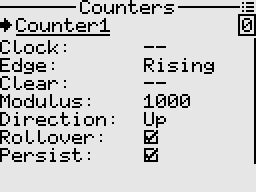
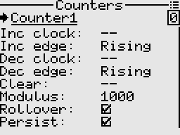

# Counters
A counters stores and shows the number of times a particular event has occurred, in relationship to a clock signal.

<p align="left">


</p>

## Fields

- Clock: The control switch that triggers the counter.
- Edge: Rising, Falling, or Dual edge triggering. Applies to the clock signal.
- Clear: The control switch that clears the counter register to zero.
- Modulus: The number of states in its count sequence. Eg. mod 4 produces the sequence 0, 1, 2, 3.
- Direction: Determines whether counts will increment or decrement.
- Rollover: Rolls back over to start counting again from zero.
- Persist: Whether to remember the value in the counter's register between sessions.

In advanced mode, the counter behaves as an up/down counter using separate "up" and "down" clocks for increment and decrement respectively.

## Examples

<a id="section_id_select_among_values_with_momentary_switch"></a>
### Example 1: Using a 3 position momentary switch to sequentially select among values.
This example demonstrates use of the counter directly inside the mixer.  
When the momentary switch is pushed in the downward direction, the counter value increments. Similarly, pushing the momentary switch in the opposite direction decrements the counter value.  
In the counter screen context menu, change the counter type to advanced.  
Assuming SwG is our 3 position momentary switch, setup the counter as follows.

```txt
Counter1
---------
Inc clock:  SwG_down
Inc edge:   Rising
Dec clock:  SwG_up
Dec edge:   Rising
Modulus:    4
Rollover:   False
```

Then in the Mixer,

```txt
1. Ch1  Add  Counter1  (Weight 100)

```

Note: The mixer automatically maps the counter's value in proportion to the counter's modulus.  
For example if the modulus is 4, then mapping is {(0,-100), (1,-33), (2,33), (3,100)}.