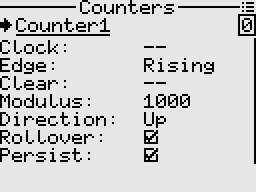
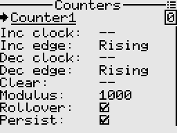

# Counters
A counter stores and shows the number of times a particular event has occurred, in relationship to a clock signal.

<p align="left">


</p>

- **Clock:** The control switch that triggers the counter.
- **Edge:** Rising, Falling, or Dual edge triggering. Applies to the clock signal.
- **Clear:** The control switch that clears the counter register to zero.
- **Modulus:** The number of states in its count sequence. E.g. mod 4 produces the sequence 0, 1, 2, 3.
- **Direction:** Determines whether counts will increment or decrement.
- **Rollover:** Rolls back over to start counting again from zero.
- **Persist:** Whether to remember the value in the counter's register between sessions.

In advanced mode, the counter behaves as an up/down counter using separate "up" and "down" clocks for increment and decrement respectively.

## Usage examples
[1. Using a 3 position momentary switch to sequentially select among values](#section_id_select_among_values_with_momentary_switch)  
[2. Using a 3 position momentary switch to continuously adjust a value](#section_id_continuously_adjust_value_with_momentary_switch)  

<a id="section_id_select_among_values_with_momentary_switch"></a>
### Example 1: Using a 3 position momentary switch to sequentially select among values
This example demonstrates use of the counter directly inside the mixer.  
When the momentary switch is pushed in the downward direction, the counter value increments. Similarly, pushing the momentary switch in the opposite direction decrements the counter value.  
In the counter screen context menu, change the counter type to advanced.  
Assuming SwG is our 3 position momentary switch, set up the counter as follows.

```txt
Counter1
Inc clock:  SwG_down
Inc edge:   Rising
Dec clock:  SwG_up
Dec edge:   Rising
Modulus:    4
Rollover:   False
```

Then in the Mixer,

```txt
1. Ch1  Add  Counter1  (Weight 100)
```

The mixer automatically maps the counter's value in proportion to the counter's modulus. For example if the modulus is 4, then mapping is {(0,-100), (1,-33), (2,33), (3,100)}.

<a id="section_id_continuously_adjust_value_with_momentary_switch"></a>
### Example 2: Using a 3 position momentary switch to continuously adjust a value
When the switch is pushed in one direction, the counter continuously increments until the switch is released. Similarly, the counter continuously decrements
when the switch is pushed in the opposite direction.  
For this, we set up some logical switches, like so.

```txt
L1
Functn: AND
Value1: !L1
Value2: SwG_down

L2
Functn: AND
Value1: !L2
Value2: SwG_up
```

In the above, we are essentially creating ring oscillators, though with only a single NOT stage.  
This exploits the fact that the main program loop runs at about 50 times per second, thus we generate oscillations of about 25 Hz frequency.  
We then use L1 and L2 to clock the counter as follows.

```txt 
Counter1
Inc clock:  L1
Inc edge:   Rising
Dec clock:  L2
Dec edge:   Rising
Modulus:    100
Rollover:   False
```

Here, the modulus can be any value. For example if our modulus is 100, it will take 4 seconds (=100/25) to increment from 0 to 99.  

We then use the counter as input inside the Mixer like follows. 

```txt  
1. Ch1  Add  Counter1  (Weight 100)
```

The mixer automatically maps the counter's value in proportion to the counter's modulus, to the range -100 to 100.  
We can also specify some "slow up/down" of 4 seconds in the mixer to smooth the output.

Alternatively, we can adapt this example to use a self-centering stick axis like X4, instead of the momentary switch.

---

Back to [user guide](user_guide.md).