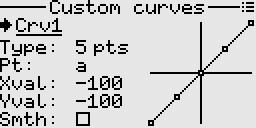

# Custom curves
These can be used in the mixer and the outputs screen. They basically define a relation between an input (along the x) and output (along the y).  
Any point/node on the curve can be freely moved around to get the desired shape of curve. Up to 10 points/nodes can be defined.  
The curve can also be optionally smoothed, although this feature should be used sparingly as it is relatively CPU intensive.  

#### Combining two curves for extra points or nodes
If more curve points are needed, a work around is to combine two curves by switching out one for the other in the mixer, with help of a logical switch.

## Usage examples
Below are some examples demonstrating the use of custom curves.

[Landing gear sequencer](./mixer.md#section_id_landing_gear_sequencer_v1)  
[Landing gear sequencer - advanced](./mixer.md#section_id_landing_gear_sequencer_v2)  
[Oscillator from scratch](./mixer.md#section_id_oscillator_from_scratch)  

