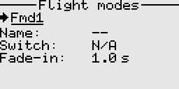

# Flight modes

Flight modes allow you to easily reconfigure settings such as mixes and trim values with the simple flip of a switch. While it's possible to achieve similar adjustments using multiple switches, having the ability to make all these changes with just one switch is undoubtedly more efficient and convenient.

#### Fields
- Name: A name/label for this flight mode. 
- Switch: The control switch that activates this flight mode.
- Fade-in: The transition time to effect the trim setting for this flight mode.
