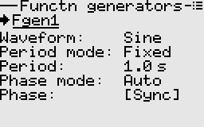
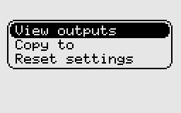

# Function generators

These produce various waveforms over a range of frequencies or periods. They are implemented as low frequency
oscillators, hence the reason why period instead of frequency is specifiable.  
Supported waveforms are sine, square, triangle, sawtooth, pulse, and random.  
The function generators are capable of frequency modulation, with smooth transition between frequencies.

## Usage examples
Below are some examples making use of function generators.

[Servo tester](./mixer.md#section_id_servo_tester)  
[Random servo motion generator](./mixer.md#section_id_random_servo_motion_generator)  
[Random servo motion generator - advanced](./mixer.md#section_id_random_servo_motion_advanced)

