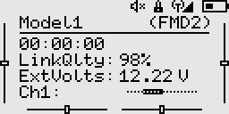

# Home screen

The home screen is the default screen shown when operating the transmitter. It displays basic information such as the active model name, trims, status icons, transmitter battery, active flight mode, and up to four custom widgets.

Key actions on the home screen are as follows:

- Down key
    - Click: Opens the context menu.
    - Hold:  Quickly mutes/unmutes telemetry alarms.
- Up key
    - Click: Opens the channel monitor.
    - Hold:  Enters the on-screen trim mode on handsets that lack physical trim buttons.
- Select Key
    - Click: Opens the main menu.
    - Hold: Navigate back. This is also the default behaviour in all screens.

