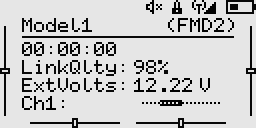
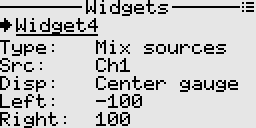

# Home screen

The home screen is the default screen shown when operating the transmitter. It displays basic information such as the active model name, trims, status icons, transmitter battery, active flight mode, and up to four custom widgets.

Key actions on the home screen are as follows:

- Down key
    - Click: Opens the context menu.
    - Hold:  Quickly mutes/unmutes telemetry alarms.
- Up key
    - Click: Opens the channel monitor.
    - Hold:  Enters the on-screen trim mode on handsets that lack physical trim buttons.
- Select Key
    - Click: Opens the main menu.
    - Hold: Navigate back. This is also the default behaviour in all screens.

### Widgets

Customizable widgets allow the user to display/monitor different parameters directly on the home screen.  
To set up the widgets, access the home screen context menu.

- **Type:** The category of widget, i.e. Telemetry, Mix sources, Outputs, Timers, or Counters.
- **Source:** The input source for the widget.
- **Display:** Specifies how the widget is shown on the home screen, i.e. as a numerical value, a gauge, or a zero-centered gauge. 
Available options depend on the type of widget selected.
- **Minimum and Maximum:** Sets the lower and upper limits of the gauge.

---

Back to [user guide](user_guide.md).