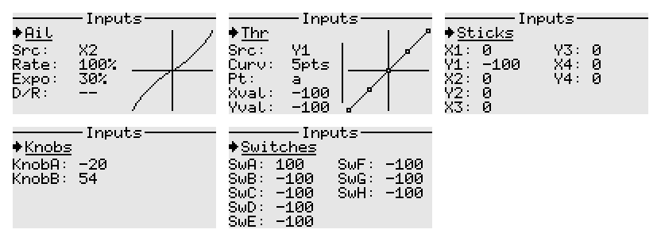
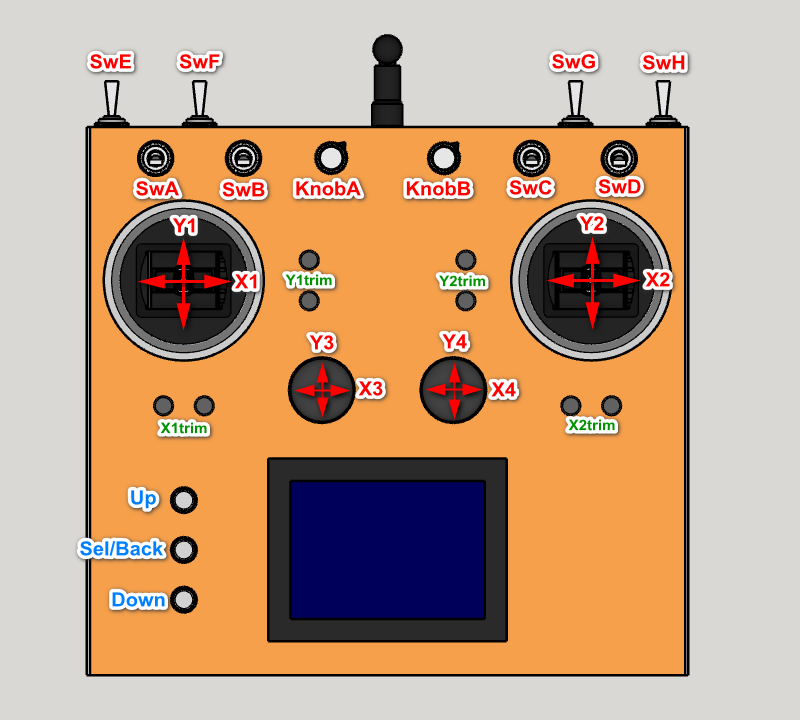

# Inputs

The inputs screen allows setting dual rates and expo, throttle curve, as well as showing the values from the physical controls.

- For model type 'Airplane', the naming used for the main controls is Ail, Ele, Rud, Thr.
- For model type 'Multicopter', the nomenclature changes to Roll, Pitch, Yaw, Thr.
- The sources for the above inputs may default to a different order based on the chosen stick mode in System settings.
- The system accepts both 2-position and 3-position switches, as well as their momentary variants.  

The image below depicts is a typical layout of the transmitter.

