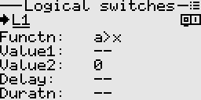

# Logical switches
These can be used to combine various conditions, compare values, etc. They are in essence user
programmed virtual switches. They produce an on/off output.

<p align="left">

</p>

The available functions can be categorized into the following types.
- Comparators (Greater than, Less than, Equal, Greater than or equal, Less than or equal)
- Combinational (AND, OR, XOR)
- Latches (SR latch)
- Flip-flops (Toggle)
- Generators (Pulse)

## Usage examples

[1. A mix activated by combination of two switches](#section_id_mix_activated_by_two_switches)  
[2. LED lights that flash when flight battery is low](#section_id_led_lights_flashing_low_battery)  
[3. Stopwatch operated by a single momentary switch](#section_id_stopwatch_with_momentary_switch)  
[4. Throttle timer - simple](#section_id_throttle_timer_simple)  
[5. Throttle timer - advanced](#section_id_throttle_timer_advanced)  
[6. Zero crossing detection](#section_id_zero_crossing_detection)  
[7. Using a momentary switch to cycle among values](#section_id_cycle_among_values_with_momentary_switch)  
[8. Detecting receiver connection or disconnection ](#section_id_detect_disconnection_of_receiver)  

<a id="section_id_mix_activated_by_two_switches"></a>
### Example 1: A mix activated by combination of two switches
Suppose we want a mix to be turned on only when two switches (e.g. SwA, SwB) are both on. 
We need to set up a logical switch say L1 as follows.

```txt
L1
---
Functn: AND
Value1: SwA_down
Value2: SwB_down

```
Then in the mixer, we simply have to set the control switch to L1.

<a id="section_id_led_lights_flashing_low_battery"></a>
### Example 2: LED lights that flash when flight battery is low
Suppose we have a model that is equipped with some LED lights that we want to switch on when the flight battery
voltage (telemetry) falls below a certain threshold for more than say five seconds.
<br>We can easily achieve this like so.

```txt
L1
---
Functn: a<x
Value1: FlghtBatt
Value2: 10.80 V
Delay:  5.0 s

L2
---
Functn: Pulse
Width:  1.0 s
Period: 2.0 s

``` 
Then in the mixer, we simply use L2 as the input source and L1 as the control switch for the mix, to
operate the channel assigned to the LED lights.

<a id="section_id_stopwatch_with_momentary_switch"></a>
### Example 3: Stopwatch operated by a single momentary switch for start/stop and reset
When the switch is clicked, the timer runs/stops. When the switch is held long enough, the timer is
reset. 
<br>For this, we set up two logical switches to operate the timer as below, assuming SwH is our momentary switch.

```txt
L1
---
Functn: Toggle
Clock:  SwH_down
Edge:   Falling
Clear:  L2

L2
---
Functn:   a>x
Value1:   SwH
Value2:   0
Delay:    0.5 s

Timer1
------
Switch:  L1
Reset:   L2

```

<a id="section_id_throttle_timer_simple"></a>
### Example 4: Throttle timer (simple)
When the throttle is moved beyond a certain threshold, the timer runs.  
Also if we have a throttle cut function on say SwA, we want the timer to only run when throttle cut is inactive.  
Assume the throttle source is the Y1 axis.

```txt
L1
---
Functn: a>x
Value1: Y1
Value2: -90

L2
---
Functn:   AND
Value1:   L1
Value2:   SwA_down

Timer1
------
Switch:  L2

```

<a id="section_id_throttle_timer_advanced"></a>
### Example 5: Throttle timer (advanced)
Suppose we want the speed at which the timer runs to be proportional to the throttle value.  
Also if we have a throttle cut function on say SwA, we want the timer to only run when throttle cut is inactive.  
Assume our throttle source is the Y1 axis. 

#### Method 1: 
Using the built-in function generator to generate a pulse width modulated signal that controls the timer.

```txt
Fgen1
-----
Waveform:   Pulse
Width mode: Variable
Modulator:  Y1
Reverse:    False
Period:     1.0 s

L1
---
Functn: a>x
Value1: Fgen1
Value2: 0

L2
---
Functn:   AND
Value1:   L1
Value2:   SwA_down

Timer1
------
Switch:  L2

```

#### Method 2:
Using the mixer and a virtual channel to create a pulse width modulated signal that controls the timer.

```txt
Mixer
-----
1. Virt1  Add  L1 (Weight 99, SlowUp 0.5 s, SlowDown 0.5 s)

L1
---
Functn: Pulse
Width:  0.5 s
Period: 1.0 s

L2
---
Functn:   a>b
Value1:   Y1
Value2:   Virt1

L3
---
Functn:   AND
Value1:   L2
Value2:   SwA_down

Timer1
------
Switch:  L3

```

If desired, we can also include a custom curve through a virtual channel, to compensate for the real world
nonlinear relationship between current draw and throttle value. 

<a id="section_id_zero_crossing_detection"></a>
### Example 6: Zero crossing detection
Suppose we want to detect whenever a value from say a function generator crosses zero, so that 
we can trigger some other action.

```txt
L1
---
Functn: a>=x
Value1: Fgen1
Value2: 0

L2
---
Functn:   |delta|>x
Value1:   L1
Value2:   0
Dirctn:   Both

```

L2 will now output a brief pulse whenever the output of the function generator crosses zero.

<a id="section_id_cycle_among_values_with_momentary_switch"></a>
### Example 7: Using a momentary switch to cycle among four values or states
Suppose we want an output channel to cycle among four levels whenever we click the momentary switch.

#### Method 1:
Set up a '2-bit' binary counter with its outputs on L2 and L1 as follows.

```txt
L1
---
Functn: Toggle
Clock:  SwH_down
Edge:   Rising 

L2
---
Functn: Toggle
Clock:  L1
Edge:   Falling

```

Use a truth table to set up logical switches L3, L4, L5, and L6

| L2 | L1 |    |
|----|----|----|
| 0  | 0  | L3 |
| 0  | 1  | L4 |
| 1  | 0  | L5 |
| 1  | 1  | L6 |

```txt
L3
---
Functn: AND
Value1: !L2
Value2: !L1

L4
---
Functn: AND
Value1: !L2
Value2: L1

L5
---
Functn: AND
Value1: L2
Value2: !L1

L6
---
Functn: AND
Value1: L2
Value2: L1

```

Then in the Mixer,

```txt
1. Ch1  RplW  Max  (Weight -100,  Switch L3)
2. Ch1  RplW  Max  (weight -33,   Switch L4)
3. Ch1  RplW  Max  (weight  33,   Switch L5)
4. Ch1  RplW  Max  (weight  100,  Switch L6)

```
#### Method 2:
This makes use of the built-in counter as follows.

```txt
Counter1
--------
Clock:   SwH_down
Edge:    Rising
Modulus: 4
Dirctn:  Up

L3
---
Functn: a==x
Value1: Counter1
Value2: 0

L4
---
Functn: a==x
Value1: Counter1
Value2: 1

L5
---
Functn: a==x
Value1: Counter1
Value2: 2

L6
---
Functn: a==x
Value1: Counter1
Value2: 3

```
Then in the Mixer,

```txt
1. Ch1  RplW  Max  (Weight -100,  Switch L3)
2. Ch1  RplW  Max  (weight -33,   Switch L4)
3. Ch1  RplW  Max  (weight  33,   Switch L5)
4. Ch1  RplW  Max  (weight  100,  Switch L6)
```

#### Method 3:
This makes use of the built-in counter directly in the Mixer. [See the example](./counters.md#section_id_select_among_values_with_momentary_switch) under counters.  

<a id="section_id_detect_disconnection_of_receiver"></a>
### Example 8: Detecting receiver connection or disconnection
This relies on the Link Quality telemetry to detect connection/disconnection of a receiver.  
First, configure the Link Quality telemetry (premade template already available).  
Then set up a logical switch and custom notifications as follows.

```txt
L1
---
Functn: a>x
Value1: LinkQlty
Value2: 0

Notification1
-------------
Switch: L1
Tone:   (Your preferred tone)
Text:   RX connect

Notification2
-------------
Switch: !L1
Tone:   (Your preferred tone)
Text:   RX disconnect
```

This example can also be adapted to detect when telemetry from a sensor is lost or recovered.