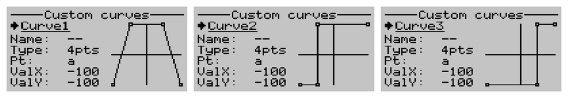

# The Mixer

## Mixer sources
Mixer sources can be any of the following
- Raw stick axes (X1, Y1, X2, Y2, ...)
- Processed sticks (Rud/Yaw, Thr, Ail/Roll, Ele/Pitch)
- Knobs (KnobA, KnobB)
- Constants (Max)
- Function generators (Fgen1, Fgen2, ...)
- Physical switches (SwA, SwB, ...)
- Logical switches (L1, L2, ...)
- Channels (Ch1, Ch2, ...)
- Virtual channels (Virt1, Virt2, ...)

## Mixer fields
- Output: The channel that is to be affected by the mix. If none, the mix is inactive and is not computed.
- Switch: The control switch to turn on or off the mix. The mix is always active if no is switch specified.
- Operation: Add, Multiply, Replace, Hold.
- Input: This is the mixer source.
- Weight: Determines how much of an effect the input has on the output. -100 to 100. 
- Offset: The input is offset by this value after the weight has been applied. -100 to 100. 
- Curve: Differential, Expo, Function, Custom curve.
- Curve value: Differential {-100 to 100}, Expo {-100 to 100}, Function {x>0, x<0, |x|}, Curve name if custom curve.
- Trim: Whether to add trim or not. Only available for Ail, Ele, Rud, or Thr.
- F-Mode: The flight mode in which the mix applies.
- Delay Up and Down: This is used to delay the input.
- Slow Up and Down: This when non-zero specifies how fast the input changes.

## Order of mixer operations
<p align="left">

</p>

## Important safety note
When editing mixes, it is recommended to disable RF output or remove propellers first.
<br>This is because all changes/adjustments made are applied instantly and may bring surprises :-)

## Example mixes
Note: 
<br>The convention used in these examples is -ve for left/down going control surfaces, +ve for right/up going control surfaces. 
<br>For example if the Ail stick is moved right, the left aileron moves down and right aileron moves up.
<br>If a servo is moving in wrong direction, reversing the direction in Outputs screen solves this.

### Example 1: Elevon
Left servo in Ch1, right servo in Ch2
```txt
1. Ch1  Add  Ail (Weight -50)
2. Ch1  Add  Ele (Weight -50)
3. Ch2  Add  Ail (Weight 50)
4. Ch2  Add  Ele (Weight -50)
```

### Example 2: Vtail
Left servo in Ch2, right servo in Ch4
```txt
1. Ch2  Add  Rud (Weight 50)
2. Ch2  Add  Ele (Weight -50)
3. Ch4  Add  Rud (Weight -50)
4. Ch4  Add  Ele (Weight -50)
```

### Example 3: Aileron differential
Left aileron in Ch1, right aileron in Ch8. We want the downward going aileron to get less displaced
than the upward going aileron. Due to differences in lift and air pressure on the top and bottom wing surfaces, 
the aileron surface produces more drag when it moves down than when it moves up. This tends to cause 
an adverse yaw effect hence the need for aileron differential.
```txt
1. Ch1  Add  Ail (Weight -100, Diff 30)
2. Ch8  Add  Ail (Weight 100, Diff 30)
```

### Example 4: Tailerons
Left Elevator servo in Ch6, Right Elevator servo in Ch7. The mix is turned on/off with SwG.
```txt
1. Ch6  Add  Ele (Weight -60)
2. Ch6  Add  Ail (Weight -40, SwG_Down)
3. Ch7  Add  Ele (Weight -60)
4. Ch7  Add  Ail (Weight 40, SwG_Down)
```

### Example 5: Flaperons
Left aileron in Ch1, right aileron in Ch8. Using SwC to operate the flaperons. 
<br>When SwC is in upper position, flaperons are off. In middle position half flaperons, 
and in lower position full flaperons.
<br>For smooth flaperon deployment, we use the slow up/down feature.
```txt
1. Ch1  Add  Ail (Weight -100, Diff 30)
2. Ch1  Add  SwC (Weight -40, Offset -40, SlowUp 1s, SlowDown 1s)
3. Ch8  Add  Ail (Weight 100, Diff 30)
4. Ch8  Add  SwC (Weight -40, Offset -40, SlowUp 1s, SlowDown 1s)
```

### Example 6: Crow braking 
Left ail servo in Ch1, Right Ail servo in Ch8, left flap servo in Ch5, right flap servo in Ch6.
<br>Using the three position SwC for operation. Normal aileron action occurs when SwC is in upper or middle position. 
Half flaps are deployed when SwC is in middle position. When SwC is in lower position, both ailerons 
move upward and full flaps are deployed.
```txt
1. Ch1   Add  Ail (Weight -100, Diff 30)
2. Ch1   Add  SwC (Weight 60, Func x>0, SlowUp 1s, SlowDown 1s)
3. Ch8   Add  Ail (Weight 100, Diff 30)
4. Ch8   Add  SwC (Weight 60, Func x>0, SlowUp 1s, SlowDown 1s)
5. Ch5   Add  SwC (Weight -50, Offset -50, SlowUp 1s, SlowDown 1s)
6. Ch6   Add  Ch5 (Weight 100)
```

### Example 7: Flaps working as ailerons 
This mix allows the entire trailing edge of the wing (aileron and flap) to operate as ailerons. 
Assuming the left flap servo in Ch5, right flap servo in Ch6.
<br>Using a two position switch e.g SwD to switch between flap mode and aileron mode. 
<br>Using the three position SwC to set the flap position in flap mode.
```txt
1. Ch5   Add   SwC (Weight -50,  Offset -50)
2. Ch5   RplW  Ail (Weight -100, Diff 20, SwD_Down)
3. Ch6   Add   SwC (Weight -50,  Offset -50)
4. Ch6   RplW  Ail (Weight 100,  Diff 20, SwD_Down)
```

### Example 8: Differential thrust
Left motor in Ch3, right motor in Ch7. We can use a switch e.g SwE to turn the differential thrust off 
while in the air. Also assume the Rud source is the X1 axis
```txt
1. Ch3  Add  Thr (Weight 100)
2. Ch3  Add  X1  (Weight 40, SwE_Down)
3. Ch7  Add  Thr (Weight 100)
4. Ch7  Add  X1  (Weight -40, SwE_Down)
``` 
For safety, we also need to set Failsafe for both Ch3 and Ch7 in the 'Outputs' screen. 
<br>We can also add throttle cut by specifying an override switch and a value of -100.

### Example 9: Elevator throttle mixing
When the throttle is increased, some down elevator can be added to counter tendency of the model gaining 
<br> altitude when the throttle increases.

```txt
1. Ch2  Add  Ele (Weight -100)  
2. Ch2  Add  Thr (Weight -20, Offset -20)
```

### Example 10: Variable steering depending on throttle position
Steering servo in Ch6. We want the steering response to reduce with increasing throttle.
Assuming we use the X1 axis to steer, and Y1 axis as our throttle source, then
```txt
1. Ch6  Add    X1 (Weight 100)
2. Ch6  Mltply Y1 (Weight -40, Offset 60)
```

### Example 11: Adjust idle throttle with knob
Suppose we have a gas model and want to adjust the idle setting of engine with the knob without affecting full throttle.
Assuming the throttle servo is in Ch3,
```txt
1. Ch3   Add     KnobA (Weight 20, Offset 20)
2. Ch3   Mltply  Thrt (Weight -50, Offset 50)
3. Ch3   Add     Thrt (Weight 100)
```

### Example 12: Adjust maximum throttle with knob
We can adjust the maximum throttle without affecting the low throttle setting. Assuming the motor is in Ch3,
```txt
1. Ch3   Add     KnobA (Weight 20, Offset -20)
2. Ch3   Mltply  Thrt (Weight 50, Offset 50)
3. Ch3   Add     Thrt (Weight 100)
```

### Example 13: Simple throttle cut
Assuming Ch3 is the throttle channel, and assigning SwA for cut. When SwA is in the Up position, Ch3 
is locked to -100, otherwise the Throttle input is sent to Ch3
```txt
1. Ch3  Add   Thrt (Weight 100)
2. Ch3  RplW  Max  (weight -100, SwA_Up)
```
Alternatively, a much safer throttle cut can be achieved in the Outputs screen by specifying the 
override as SwA and value -100.

### Example 14: Sticky throttle cut
Assuming Ch3 is the throttle channel, and assigning SwA for cut. Also assume our Throttle source is 
Y1 axis. We want the throttle cut whenever SwA is in Up position, but to only remove the cut when 
the throttle is at minimum. This example makes use of logical switches as follows.
```txt
Logical switch L1
Func: a==x
Value1: Y1
value2: -100

Logical switch L2
Func:   Latch
Value1: SwA_Up     //sets the latch
Value2: L1         //resets the latch
``` 
Then in the mixer
```txt
1. Ch3  Add   Thrt (Weight 100)
2. Ch3  RplW  max  (Weight -100, Switch L2)
```
Alternatively, a much safer throttle cut can be achieved in the Outputs screen by specifying the 
override as L2 and value -100.

### Example 15: Landing gear sequencer (gear doors stay open after gear is extended)
Using SwD for operation. Assuming gear doors on Ch6 and gear on Ch7.
```txt
1. Ch6  Add  SwD (Weight 100, DelayUp 0s, DelayDown 3s, SlowUp 2s, SlowDown 2s)
2. Ch7  Add  SwD (Weight 100, DelayUp 3s, DelayDown 0s, SlowUp 2s, SlowDown 2s)
```

### Example 16: Landing gear sequencer (gear doors close after gear is extended)
The extend sequence is doors open, gear is lowered, doors close.
<br>The retract sequence is doors open, gear retracts, doors close.
<br>We can achieve the above using custom curves in combination with a slowed switch.

##### Servo version
Set up two custom curves as follows.
```txt
Curve1
Type: 4 point
Point(x,y): PtA(-100,-100) PtB(-50,100) PtC(50,100) PtD(100,-100)

Curve2
Type: 4 point
Point(x,y): PtA(-100,-100) PtB(-50,-100) PtC(50,100) PtD(100,100)
``` 
Then in the mixer, assuming gear door servos on Ch7, gear servos on Ch8, and using SwD to operate,
```txt
1. Virt1 Add  SwD   (Weight 100, SlowUp 7s, SlowDown 7s) //Create a source that slowly ramps
2. Ch7   Add  Virt1 (Weight 100, Custom Curve1)          //Apply curve1 for the door sequence
3. Ch8   Add  Virt1 (Weight 100, Custom Curve2)          //Apply curve3 for the gear sequence
```
##### Retract actuator version
Most electric retract actuators require an on/off control signal, so this example is designed to work with these. 
<br>Set up three custom curves as follows.
```txt
Curve1
Type: 4 point
Point(x,y): PtA(-100,-100) PtB(-50,100) PtC(50,100) PtD(100,-100)

Curve2
Type: 4 point
Point(x,y): PtA(-100,-100) PtB(-50,-100) PtC(-50,100) PtD(100,100)

Curve3
Type: 4 point
Point(x,y): PtA(-100,-100) PtB(50,-100) PtC(50,100) PtD(100,100)
```
<p align="left">

</p>

Then in the mixer, assuming gear door servos on Ch7, gear retracts on Ch8, and using SwD to operate, 
```txt
1. Virt1 Add  SwD   (Weight 100, SlowUp 10s, SlowDown 10s) //Create a source that slowly ramps
2. Ch7   Add  Virt1 (Weight 100, Custom Curve1)            //Apply curve1 for the door sequence
3. Ch8   Add  Virt1 (Weight 100, Custom Curve2)            //Apply curve2 for the gear open sequence
3. Ch8   RplW Virt1 (Weight 100, Custom Curve3, SwD_Up)    //Apply curve3 for the gear close sequence
```
We can, if necessary, set Ch8 to 'Digital' mode in the receiver output configuration screen.

### Example 17: Servo tester
We can program a simple servo tester that repeatedly moves a servo back and forth.
<br>In the inputs screen, navigate to Function generator page and select desired movement type. 
<br>Then in the mixer, assuming the servo is connected to Ch8,
```txt
1. Ch8  Add  Fgen1 (Weight 100)
```
We can even use make the above interesting by adding the ability to switch between waveforms or patterns 
via a switch. This is left as an exercise.

### Example 18: Random servo motion generator
Suppose we have a model equipped with a turret. What we would like is to move the turret automatically but in a 
random and intermittent manner, as we can't always be controlling it manually, for we only got one brain :)
<br>We can easily achieve this behaviour with function genarators and logical switches as follows.
 
```txt
Function generator Fgen1
Waveform: Random
Interval: 2.0s

Function generator Fgen2
Waveform: Random
Interval: 1.3s
``` 

```txt
Logical switch L1
Func:   a>x
Value1: Fgen2
value2: 0
``` 
Then in the mixer, assuming our turret servo is on Ch7,
```txt
1. Ch7   Add  Fgen1 (Weight 100)          
2. Ch7   Hold       (L1)          
3. Ch7   RplW Ch7   (Weight 100, SlowUp 2s, SlowDown 2s) 
```
Explanation: 
<br>Fgen1 generates a random position periodically, Fgen2 via Logical switch L1 is 
used to hold the output randomly to create the impression of intermittent motion. The last mixer line 
helps smooth the movement.
<br>If desired, we can also incorporate a custom curve to sort of bias the generated servo positions, for example
if we want our turret be pointing around the middle most of the time.
<br>We can also easily modify the setup to include an extra switch to manually stop the motion.