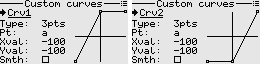

# The Mixer
The mixer is where the inputs (mixer sources) get linked to the output channels (servos, etc.).
This controller features a mixer system that draws inspiration from that found in OpenTX(R) based RC transmitters, though not directly compatible.

<p align="left">

</p>

## Mixer sources
Mixer sources can be any of the following:
- Raw stick axes (X1, Y1, X2, Y2, ...)
- Processed sticks (Rud/Yaw, Thr, Ail/Roll, Ele/Pitch)
- Knobs (KnobA, KnobB)
- Constants (Max)
- Function generators (Fgen1, Fgen2, ...)
- Trims (X1Trim, Y1Trim, X2Trim, Y2Trim)
- Physical switches (SwA, SwB, ...)
- Logical switches (L1, L2, ...)
- Channels (Ch1, Ch2, ...)
- Virtual channels (Virt1, Virt2, ...)

Counters can also be used as inputs in the mixer, although they are not classified as true mixer sources.

## Mixer fields
- Output: The channel that is to be affected by the mix. If none, the mix is inactive and is not computed.
- Switch: The control switch to turn on or off the mix. The mix is always active if no is switch specified.
- Operation: Add, Multiply, Replace, Hold.
- Input: This is the mixer source.
- Weight: Determines how much of an effect the input has on the output. -100 to 100.
- Offset: The input is offset by this value after the weight has been applied. -100 to 100.
- Curve: Differential, Expo, Function, Custom curve.
- Curve value: Differential {-100 to 100}, Expo {-100 to 100}, Function {x>0, x<0, |x|}, Curve name if custom curve.
- Trim: Whether to add trim or not.
- F-Mode: The flight mode in which the mix applies.
- Delay Up and Down: This is used to delay the input. 0 to 60 seconds.
- Slow Up and Down: This when non-zero specifies how fast the input changes. 0 to 60 seconds.

## Order of mixer operations
<p align="left">

</p>

## Important safety note
When editing mixes, it is recommended to disable RF output or remove propellers first.
<br>This is because all changes/adjustments made are applied instantly and may bring surprises :-)

## Example mixes
Note: 
- The convention used in these examples is -ve for left/downward going control surfaces, +ve for right/upward going control surfaces. For example if the Ail stick is moved right, the left aileron moves down and the right aileron moves up. Hence we use a negative weight for the left aileron and a positive weight for the right aileron.
- If a servo is moving in wrong direction, reversing the direction in Outputs screen solves this.
- The Mixer is all about control logic. Any mechanical differences should be handled in the Outputs screen and not inside the Mixer.

[1. Basic 4 channel](#section_id_basic_4_channel)  
[2. Elevon](#section_id_elevon)  
[3. Vtail](#section_id_vtail)  
[4. Aileron differential](#section_id_aileron_differential)  
[5. Tailerons](#section_id_tailerons)  
[6. Flaperons](#section_id_flaperons)  
[7. Crow braking](#section_id_crow_braking)  
[8. Flaps working as ailerons](#section_id_flaps_as_ailerons)  
[9. Differential thrust](#section_id_differential_thrust)  
[10. Throttle elevator mixing](#section_id_throttle_elevator_mix)  
[11. Variable steering depending on throttle](#section_id_variable_steering)  
[12. Adjust idle throttle with knob](#section_id_adjust_throttle_idle)  
[13. Adjust maximum throttle with knob](#section_id_adjust_max_throttle)  
[14. Simple throttle cut](#section_id_simple_throttle_cut)  
[15. Sticky throttle cut](#section_id_stick_throttle_cut)  
[16. Landing gear sequencer](#section_id_landing_gear_sequencer_v1)  
[17. Landing gear sequencer - advanced](#section_id_landing_gear_sequencer_v2)  
[18. Servo tester](#section_id_servo_tester)  
[19. Random servo motion generator](#section_id_random_servo_motion_generator)  
[20. Random servo motion generator - advanced](#section_id_random_servo_motion_advanced)  
[21. Oscillator from scratch](#section_id_oscillator_from_scratch)  
[22. Automatic aileron rudder mixing](#section_id_automatic_aileron_rudder_mix)  
[23. Adjust aileron differential with knob](#section_id_adjust_aileron_differential_with_knob)  

<a id="section_id_basic_4_channel"></a>
### Example 1: Basic 4 channel
Assuming Aileron servo in Ch1, Elevator servo in Ch2, Throttle in Ch3, Rudder servo in Ch4
```txt
1. Ch1  Add  Ail (Weight 100)
2. Ch2  Add  Ele (Weight -100)
3. Ch3  Add  Thr (Weight 100)
4. Ch4  Add  Rud (Weight 100)
```

<a id="section_id_elevon"></a>
### Example 2: Elevon
Left servo in Ch1, right servo in Ch2
```txt
1. Ch1  Add  Ail (Weight -50)
2. Ch1  Add  Ele (Weight -50)
3. Ch2  Add  Ail (Weight 50)
4. Ch2  Add  Ele (Weight -50)
```

<a id="section_id_vtail"></a>
### Example 3: Vtail
Left servo in Ch2, right servo in Ch4
```txt
1. Ch2  Add  Rud (Weight 50)
2. Ch2  Add  Ele (Weight -50)
3. Ch4  Add  Rud (Weight -50)
4. Ch4  Add  Ele (Weight -50)
```

<a id="section_id_aileron_differential"></a>
### Example 4: Aileron differential
Left aileron in Ch1, right aileron in Ch8. We want the downward going aileron to get less displaced
than the upward going aileron. Due to differences in lift and air pressure on the top and bottom wing surfaces, 
the aileron surface produces more drag when it moves down than when it moves up. This tends to cause 
an adverse yaw effect hence the need for aileron differential.
```txt
1. Ch1  Add  Ail (Weight -100, Diff 30)
2. Ch8  Add  Ail (Weight 100, Diff 30)
```

<a id="section_id_tailerons"></a>
### Example 5: Tailerons
Left Elevator servo in Ch6, Right Elevator servo in Ch7. The mix is turned on/off with SwG.
```txt
1. Ch6  Add  Ele (Weight -60)
2. Ch6  Add  Ail (Weight -40, Switch SwG_Down)
3. Ch7  Add  Ele (Weight -60)
4. Ch7  Add  Ail (Weight 40, Switch SwG_Down)
```

<a id="section_id_flaperons"></a>
### Example 6: Flaperons
Left aileron in Ch1, right aileron in Ch8. Using SwC to operate the flaperons. 
<br>When SwC is in upper position, flaperons are off. In middle position half flaperons, 
and in lower position full flaperons.
<br>For smooth flaperon deployment, we use the slow up/down feature.
```txt
1. Ch1  Add  Ail (Weight -100, Diff 30)
2. Ch1  Add  SwC (Weight -40, Offset -40, SlowUp 1 s, SlowDown 1 s)
3. Ch8  Add  Ail (Weight 100, Diff 30)
4. Ch8  Add  SwC (Weight -40, Offset -40, SlowUp 1 s, SlowDown 1 s)
```

<a id="section_id_crow_braking"></a>
### Example 7: Crow braking 
Left ail servo in Ch1, Right Ail servo in Ch8, left flap servo in Ch5, right flap servo in Ch6.
<br>Using the three position SwC for operation. Normal aileron action occurs when SwC is in upper or middle position. 
Half flaps are deployed when SwC is in middle position. When SwC is in lower position, both ailerons 
move upward and full flaps are deployed.
```txt
1. Ch1   Add  Ail (Weight -100, Diff 30)
2. Ch1   Add  SwC (Weight 60, Func x>0, SlowUp 1 s, SlowDown 1 s)
3. Ch8   Add  Ail (Weight 100, Diff 30)
4. Ch8   Add  SwC (Weight 60, Func x>0, SlowUp 1 s, SlowDown 1 s)
5. Ch5   Add  SwC (Weight -50, Offset -50, SlowUp 1 s, SlowDown 1 s)
6. Ch6   Add  Ch5 (Weight 100)
```

<a id="section_id_flaps_as_ailerons"></a>
### Example 8: Flaps working as ailerons
This mix allows the entire trailing edge of the wing (aileron and flap) to operate as ailerons. 
Assuming the left flap servo in Ch5, right flap servo in Ch6.
<br>Using a two position switch e.g. SwD to switch between flap mode and aileron mode. 
<br>Using the three position SwC to set the flap position in flap mode.
```txt
1. Ch5   Add   SwC (Weight -50,  Offset -50)
2. Ch5   RplW  Ail (Weight -100, Diff 20, Switch SwD_Down)
3. Ch6   Add   SwC (Weight -50,  Offset -50)
4. Ch6   RplW  Ail (Weight 100,  Diff 20, Switch SwD_Down)
```

<a id="section_id_differential_thrust"></a>
### Example 9: Differential thrust
Left motor in Ch3, right motor in Ch7. We can use a switch e.g. SwE to turn the differential thrust off 
while in the air. Also assume the Rud source is the X1 axis
```txt
1. Ch3  Add  Thr (Weight 100)
2. Ch3  Add  X1  (Weight 40, Switch SwE_Down)
3. Ch7  Add  Thr (Weight 100)
4. Ch7  Add  X1  (Weight -40, Switch SwE_Down)
``` 
For safety, we also need to set Failsafe for both Ch3 and Ch7 in the 'Outputs' screen.  
We can also add throttle cut by specifying an override switch and a value of -100.

<a id="section_id_throttle_elevator_mix"></a>
### Example 10: Throttle elevator mixing
When the throttle is increased, some down elevator can be added to counteract the tendency of the model gaining altitude when the throttle increases.

```txt
1. Ch2  Add  Ele (Weight -100)  
2. Ch2  Add  Thr (Weight -20, Offset -20)
```

<a id="section_id_variable_steering"></a>
### Example 11: Variable steering depending on throttle position
We want the steering response to reduce with increasing throttle.
Assuming we use the X1 axis to steer, Y1 axis as our throttle source, and the steering servo is on Ch6,
```txt
1. Ch6  Add    X1 (Weight 100)
2. Ch6  Mltply Y1 (Weight -40, Offset 60)
```

<a id="section_id_adjust_throttle_idle"></a>
### Example 12: Adjust idle throttle with knob
Suppose we have a gasoline-powered model and want to adjust the idle setting of engine with the knob without affecting full throttle.
Assuming the throttle servo is in Ch3,
```txt
1. Ch3   Add     KnobA (Weight 20, Offset 20)
2. Ch3   Mltply  Thrt  (Weight -50, Offset 50)
3. Ch3   Add     Thrt  (Weight 100)
```

<a id="section_id_adjust_max_throttle"></a>
### Example 13: Adjust maximum throttle with knob
We can adjust the maximum throttle without affecting the low throttle setting. Assuming the motor is in Ch3,
```txt
1. Ch3   Add     KnobA (Weight 20, Offset -20)
2. Ch3   Mltply  Thrt  (Weight 50, Offset 50)
3. Ch3   Add     Thrt  (Weight 100)
```

<a id="section_id_simple_throttle_cut"></a>
### Example 14: Simple throttle cut
Assuming Ch3 is the throttle channel, and assigning SwA for cut. When SwA is in the up position, Ch3 
is locked to -100, otherwise the Throttle input is sent to Ch3.
```txt
1. Ch3  Add   Thrt (Weight 100)
2. Ch3  RplW  Max  (Weight -100, Switch SwA_Up)
```
Alternatively, a much safer throttle cut can be achieved in the Outputs screen by specifying the 
override as SwA and value -100.

<a id="section_id_stick_throttle_cut"></a>
### Example 15: Sticky throttle cut
Assuming Ch3 is the throttle channel, and assigning SwA for cut. Also assume our Throttle source is 
Y1 axis. We want the throttle cut whenever SwA is in the up position, but to only remove the cut when 
the throttle is at minimum and SwA is in the down position.  
This example makes use of logical switches as follows.
```txt
L1
Func:   Latch
Set:    SwA_Up
Reset:  L3

L2
Func:   a==x
Value1: Y1
Value2: -100

L3
Func:   AND
Value1: SwA_down
Value2: L2
``` 
Then in the mixer
```txt
1. Ch3  Add   Thrt (Weight 100)
2. Ch3  RplW  Max  (Weight -100, Switch L1)
```
Alternatively, a much safer throttle cut can be achieved in the Outputs screen by specifying the 
override as L1 and value -100.

<a id="section_id_landing_gear_sequencer_v1"></a>
### Example 16: Landing gear sequencer (gear doors stay open after gear is extended)

The sequence we want upon flicking the switch is: doors open, gear extends. Similarly in the opposite direction: gear retracts, doors close. 
Using SwD for operation and assuming gear doors on Ch6 and gear on Ch7.
```txt
1. Ch6  Add  SwD (Weight 100, DelayUp 0 s, DelayDown 3 s, SlowUp 2 s, SlowDown 2 s)
2. Ch7  Add  SwD (Weight 100, DelayUp 3 s, DelayDown 0 s, SlowUp 2 s, SlowDown 2 s)
```
#### Alternative method that uses custom curves

Set up two custom curves as follows.
```txt
Curve1
Type: 3 point
Point(x,y): PtA(-100,-100) PtB(0,100) PtC(100,100)

Curve2
Type: 3 point
Point(x,y): PtA(-100,-100) PtB(0,-100) PtC(100,100)
``` 
<p align="left">

</p>

Then in the mixer, assuming gear door servos on Ch7, gear servos on Ch8, and using SwD to operate,
```txt
1. Virt1 Add  SwD   (Weight 100, SlowUp 5 s, SlowDown 5 s) //Create a source that slowly ramps
2. Ch7   Add  Virt1 (Weight 100, Custom Curve1)            //Apply curve1 for the door sequence
3. Ch8   Add  Virt1 (Weight 100, Custom Curve2)            //Apply curve2 for the gear sequence
```

<a id="section_id_landing_gear_sequencer_v2"></a>
### Example 17: Landing gear sequencer (gear doors close after gear is extended)
The extend sequence is doors open, gear is lowered, doors close.
<br>The retract sequence is doors open, gear retracts, doors close.
<br>We can achieve the above using custom curves in combination with a slowed switch.

#### Servo version
Set up two custom curves as follows.
```txt
Curve1
Type: 4 point
Point(x,y): PtA(-100,-100) PtB(-50,100) PtC(50,100) PtD(100,-100)

Curve2
Type: 4 point
Point(x,y): PtA(-100,-100) PtB(-50,-100) PtC(50,100) PtD(100,100)
``` 
<p align="left">

</p>

Then in the mixer, assuming gear door servos on Ch7, gear servos on Ch8, and using SwD to operate,
```txt
1. Virt1 Add  SwD   (Weight 100, SlowUp 7 s, SlowDown 7 s) //Create a source that slowly ramps
2. Ch7   Add  Virt1 (Weight 100, Custom Curve1)            //Apply curve1 for the door sequence
3. Ch8   Add  Virt1 (Weight 100, Custom Curve2)            //Apply curve2 for the gear sequence
```

#### Retract actuator version
Most electric retract actuators require an on/off control signal, so this example is designed to work with these. 
<br>Set up three custom curves as follows.
```txt
Curve1
Type: 4 point
Point(x,y): PtA(-100,-100) PtB(-50,100) PtC(50,100) PtD(100,-100)

Curve2
Type: 4 point
Point(x,y): PtA(-100,-100) PtB(-50,-100) PtC(-50,100) PtD(100,100)

Curve3
Type: 4 point
Point(x,y): PtA(-100,-100) PtB(50,-100) PtC(50,100) PtD(100,100)
```
<p align="left">

</p>

Then in the mixer, assuming gear door servos on Ch7, gear retracts on Ch8, and using SwD to operate, 
```txt
1. Virt1 Add  SwD   (Weight 100, SlowUp 10 s, SlowDown 10 s)   //Create a source that slowly ramps
2. Ch7   Add  Virt1 (Weight 100, Custom Curve1)                //Apply curve1 for the door sequence
3. Ch8   Add  Virt1 (Weight 100, Custom Curve2)                //Apply curve2 for the gear extend sequence
4. Ch8   RplW Virt1 (Weight 100, Custom Curve3, Switch SwD_Up) //Apply curve3 for the gear retract sequence
```
We can, if necessary, set Ch8 to 'Digital' mode in the receiver output configuration screen.

<a id="section_id_servo_tester"></a>
### Example 18: Servo tester
We can program a simple servo tester that repeatedly moves a servo back and forth.
<br>In the extras menu, navigate to Function generator and select the desired movement type. 
<br>Then in the mixer, assuming the servo is connected to Ch8,
```txt
1. Ch8  Add  Fgen1 (Weight 100)
```
We can also make it more interesting by adding the ability to switch between waveforms or patterns 
via a switch. This is left as an exercise.

<a id="section_id_random_servo_motion_generator"></a>
### Example 19: Random servo motion generator
Suppose we have a model equipped with a turret, or a figure. We want the servo to move automatically but in a 
random and intermittent manner.
<br>We can achieve this with function generators and logical switches as follows.
 
```txt
Fgen1
Waveform: Random
Interval: 2.0 s

Fgen2
Waveform: Random
Interval: 1.3 s
``` 

```txt
L1
Func:   a>x
Value1: Fgen2
Value2: 0
``` 
Then in the mixer, assuming our servo is on Ch7,
```txt
1. Ch7   Add  Fgen1 (Weight 100)
2. Ch7   Hold       (Switch L1)
3. Ch7   RplW Ch7   (Weight 100, SlowUp 2 s, SlowDown 2 s)
```
Explanation: 
<br>Fgen1 generates a random position periodically, Fgen2 via Logical switch L1 is 
used to hold the output randomly to create the impression of intermittent motion. The last mixer line 
helps smooth the movement.
<br>If desired, we can also incorporate a custom curve to sort of bias the generated servo positions, for example
if we want our turret be pointing around the middle most of the time.
<br>We can also easily modify the setup to include an extra switch to manually stop the motion.

<a id="section_id_random_servo_motion_advanced"></a>
### Example 20: Random servo motion generator (advanced version)
This example generates a random servo position at a random interval, with an added effect of 
random intermittency, and also random selection between two speeds.  
Furthermore, a physical switch SwE is used to start/stop the random motion of the servo.

```txt
Fgen1
Waveform:      Random
Interval mode: Variable
Min Interval:  1.0 s
Max Interval:  2.0 s
Control:       Fgen2

Fgen2  (modulates the interval of Fgen1)
Waveform:      Random
Interval mode: Fixed
Interval:      1.0 s

Fgen3  (used for the intermittent motion)
Waveform:      Random
Interval mode: Fixed
Interval:      1.0 s

Fgen4  (used for the selection between two speeds)
Waveform:      Random
Interval mode: Fixed
Interval:      2.0 s
```

Then set up two logical switches as follows.
```txt
L1
Func:   a>x
Value1: Fgen3
Value2: 0

L2
Func:   a>x
Value1: Fgen4
Value2: 0
``` 

Then in the mixer, assuming our servo is on Ch7,
```txt
1. Ch7   Add   Fgen1 (Weight 100)
2. Ch7   Hold        (Switch L1)
3. Ch7   RplW  Max   (Weight 0, SwE_Up) 
4. Ch7   RplW  Ch7   (Weight 100, SlowUp 5 s, SlowDown 5 s, Switch L2)
5. Ch7   RplW  Ch7   (Weight 100, SlowUp 2 s, SlowDown 2 s)
```

<a id="section_id_oscillator_from_scratch"></a>
### Example 21: Oscillation without using the built-in function generator
Here is a way to create a crude oscillator from scratch.  
Set up a custom curve that defines the shape of our arbitrary waveform. For example,
```txt
Curve1
Type: 5 point
Point(x,y): PtA(-100,0) PtB(-50,-100) PtC(0,0) PtD(50,100), PtE(100, 0)
Smooth: True
```
Then define a logical switch as follows.
```txt
L1
Func:   a<x
Value1: Virt1
Value2: 100
``` 
Then in the mixer, we make use of the 'slow' feature on the L1 mixer input.
This essentially creates a sawtooth waveform on Virt1.
Assuming our final output is on Ch1, we specify the input as Virt1 and apply the custom curve.
```txt
1. Virt1  Add  L1    (Weight 100, SlowUp 1 s, SlowDown 0 s)
2. Ch1    Add  Virt1 (Weight 100, Custom Curve1)
```

<a id="section_id_automatic_aileron_rudder_mix"></a>
### Example 22: Aileron rudder mixing with automatic switching
When the Rudder stick is centered and the Aileron stick is moved away from center, the mix is activated (Aileron stick now controls the rudder).
<br>The mix is deactivated as soon as the Rudder stick is moved away from center (Rudder stick now controls the Rudder).
<br>When both sticks are centered the mix gets activated again.
<br>We can achieve this behaviour with the help of logical switches as follows.
```txt
L1
Func:   a==x
Value1: Rud
Value2: 0

L2
Func:   a==x
Value1: Ail
Value2: 0

L3
Func:   AND
Value1: L1
Value2: L2

L4
Func:   Latch
Set:    L3
Reset:  !L1
``` 
Then in the mixer, assuming the rudder servo is on Ch4,
```txt
1. Virt1 Add     Max   (Weight 100, Switch L4)
2. Ch4   Add     Ail   (Weight 100, No trim)
3. Ch4   Mltply  Virt1 (Weight 100, SlowDown 1 s)
4. Ch4   Add     Rud   (Weight 100)
```
Here, Virt1 is used to smooth the transition from the Aileron stick to the Rudder stick.


<a id="section_id_adjust_aileron_differential_with_knob"></a>
### Example 23: Adjust aileron differential with the knob
This example illustrates a method for adjusting aileron differential in-flight, eliminating the need to land whenever we want to
tweak the setting. It is quite handy for experimenting with different values and helping with fine tuning.  
As we rotate the knob clockwise, the differential increases from 0% to 100%.

Setup a logical switch as follows.
```txt
L1
Func:   a>x
Value1: Ail 
Value2: 0
``` 
Then in the mixer, assuming the left aileron servo in Ch1, right aileron servo in Ch8
```txt
1. Ch1   Add     Ail    (Weight -100, No trim)
2. Ch1   Mltply  KnobB  (Weight -50, Offset 50, Switch L1)
3. Ch1   Add     X2Trim (Weight -100)
4. Ch8   Add     Ail    (Weight 100, No trim)
5. Ch8   Mltply  KnobB  (Weight -50, Offset 50, Switch !L1)
6. Ch8   Add     X2Trim (Weight 100)
```
Explanation:  
Differential is applied to the downward going aileron. When the Ail stick is moved right, we apply differential to the left aileron.
Similarly when the Ail stick is moved left, we apply differential to the right aileron.  
We detect the direction of the Ail stick via the logical switch L1 and use it to selectively apply the differential effect via a multiply mix.  
For this case, we also decouple the trim and add it afterward, to prevent it being affected by the differential.

---

Back to [user guide](user_guide.md).