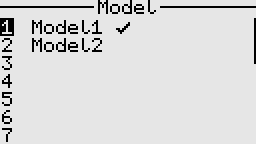
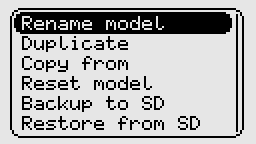
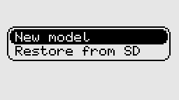

# Model manager

The model manager enables various actions, such as creating, loading, and deleting models. By default, model settings are stored in the EEPROM.

SD cards are also supported and are useful for backing up and restoring models. Model data on the SD card is stored
in a human-readable text format similar to YAML.

Note:
1. An external EEPROM is recommended but not mandatory. However, without it, the system will only have one model slot available, 
which makes it cumbersome to switch between different models, as we would always need to rely on the SD card to load a different model.
2. Before updating the firmware in the transmitter, always back up your models to the SD card to avoid any potential data loss or corruption.
3. The "Copy from" feature only works between models of the same type.
4. Loading or selecting a new model disables RF output for safety reasons; therefore, RF output must be manually re-enabled afterward.