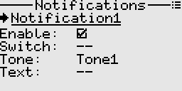

# Notifications
Notifications are user-programmable and provide audible alarms to report about events.

## Fields
- Enable: Whether the notification is enabled or disabled. Only enabled notifications will be sounded and displayed.
- Switch: The control switch used to trigger the notification. The notification gets only triggered on the positive going edge, i.e. when the state of the switch changes from low to high.
- Tone: The tune to play when the notification is triggered.
- Text: Optional text that will be displayed, as a toast message on the screen.

Note: 
System events like low transmitter battery, inactivity, etc. are natively handled by the system, thus there is no need to configure them inside custom notifications. 

## Usage examples

- [Detecting receiver connection or disconnection ](./logical_switches.md#section_id_detect_disconnection_of_receiver) 

---

Back to [user guide](user_guide.md).