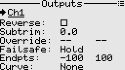
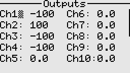

# Outputs

Outputs are the last stage of the processing chain (Inputs ---> Mixer ---> Outputs).  
It is where final adjustments to the control data are made before transmission to the receiver.

## Fields

- Reverse: Useful for correcting the servo or actuator direction relative to the controls.
- Subtrim: Adjusts the center position of the servo or actuator. A side effect of using subtrim 
is that it causes clipping at the ends. E.g. if the mixer is outputting -100 to 100, a subtrim of say +5 
shifts the usable range of the servo to -95 to 100.
- Override: This is mainly a safety feature used for throttle cut, etc. It overrides the channel's output 
with the specified value when the activation switch is on.
- Failsafe: The receiver will output the specified value after about 1 second of signal loss from the transmitter.
Supported modes are Hold, No pulse, or custom value.
- Endpoints: Sets the overall travel or endpoints of the servo arm movement. Useful when we want to avoid any potential binding of a linkage or surface.
- Curve: Specifies the custom curve to use for this output. Useful when we want to correct for linkage geometry, mechanical differences, etc.

---

Back to [user guide](user_guide.md).