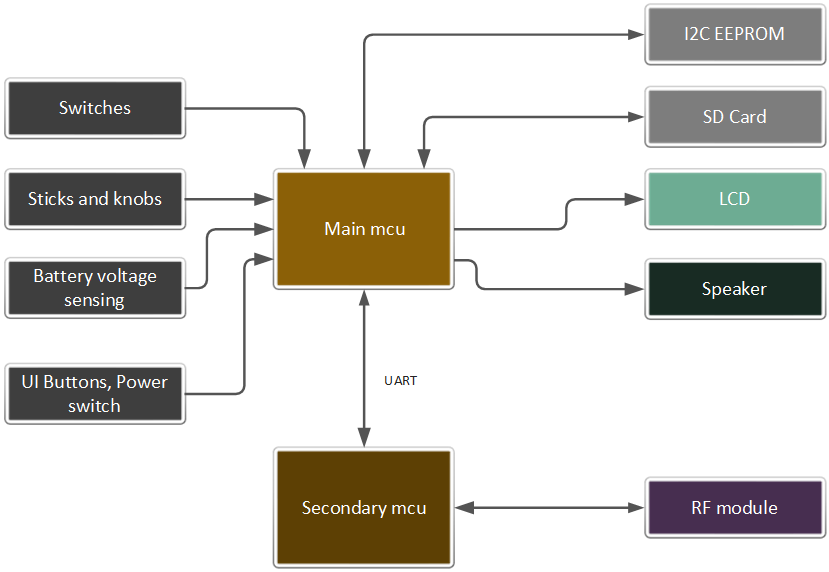

# Overview

FreeTX is an innovative and open-source radio control system designed to empower creators, hobbyists, and engineers alike! Say goodbye to limitations and hello to endless possibilities as you explore a versatile platform that adapts to your unique needs.  
Whether you're piloting model aircraft, controlling land vehicles, or bringing robots to life, the system 
combines many cutting-edge features inspired by other RC systems while introducing numerous new & innovative concepts.
The only limit is your imagination.

## Default configuration

By default, the system is configured with the following features.

- 10 stick input axes, 8 switches, 2 knobs
- 40 mixer slots, 20 proportional RC channels
- 10 custom curves, 10 max points per curve
- 20 logical switches, 5 function generators, 3 timers, 5 counters
- 10 custom notifications 
- 5 flight modes
- 6 telemetry sensor slots

Many of these numbers are easily customisable before firmware compilation, the limit being the available memory and I/O pins. 

## System architecture

### Hardware block diagram

## RF protocol

A custom RF protocol is used to communicate between the transmitter and receiver. The implementation builds on top of LoRa(R) transceivers. Documentation can be found in the Protocols folder.  
The main features are as follows:
- 10 bit encoding for all RC channels
- 50 Hz update rate for all RC channels
- Frequency Hopping Spread Spectrum
- Telemetry support
