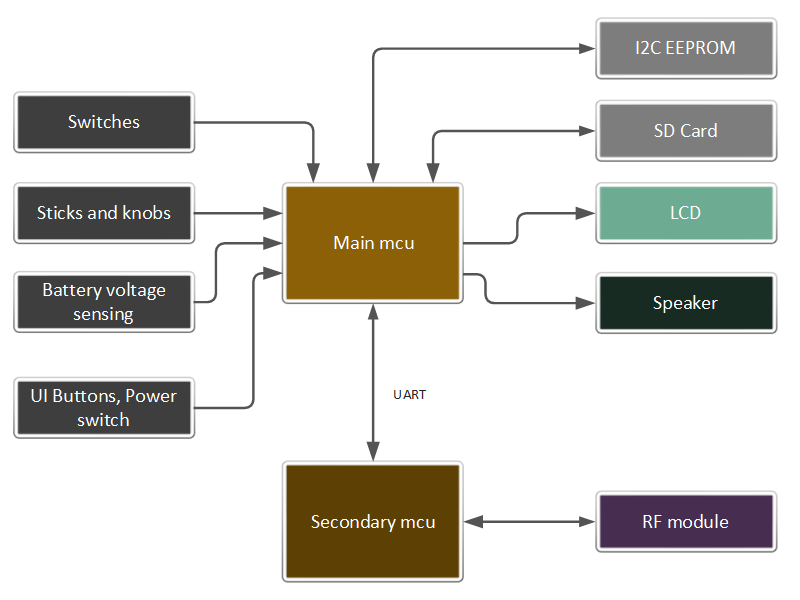

# Overview

FreeTX is an open-source radio control system you can use for just about anything. It combines features from different RC systems and brings in new ideas too. It’s perfect for creators, hobbyists, and engineers. The main goal is to give you more freedom and choice with what you want to do.

## Default configuration

By default, the system is configured with the following features.

- 10 stick input axes, 8 switches, 2 knobs
- 40 mixer slots, 20 proportional RC channels
- 10 custom curves, 10 max points per curve
- 20 logical switches, 5 function generators, 3 timers, 5 counters
- 10 custom notifications 
- 5 flight modes
- 6 telemetry sensor slots

Many of these numbers are easily customisable in the source code, the limit being the available memory and I/O pins. 

## System architecture

#### Hardware block diagram

## RF protocol

A custom RF protocol is used to communicate between the transmitter and receiver. The implementation builds on top of LoRa(R) transceivers. The documentation can be found in the Protocols folder.  
The main features are:-
- 10 bit encoding for all RC channels
- 50 Hz update rate for all RC channels
- Frequency Hopping Spread Spectrum
- Telemetry support

---

Back to [user guide](user_guide.md).