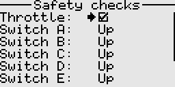
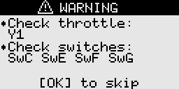

# Safety checks

These checks are done before loading a model and on startup.  
Positions of switches as well as the throttle source are checked, depending on the setting.  
A warning will be shown if the set conditions are not met.

