# System settings

The System menu provides comprehensive configuration options so you can tailor the device to your needs. Settings are organized into categories for easy navigation and quick access to the options you want. Use this menu to adjust settings that affect overall system operation.

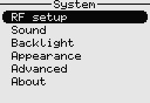

- [RF setup](#section_id_rf_setup)  
- [Sound](#section_id_sound)  
- [Backlight](#section_id_backlight)  
- [Appearance](#section_id_appearance)  
- [Miscellaneous](#section_id_miscellaneous)  
- [Advanced](#section_id_advanced_settings)  
  - [Sticks](#section_id_sticks)  
  - [Knobs](#section_id_knobs)  
  - [Switches](#section_id_switches)  
  - [Battery](#section_id_battery)  
  - [Security](#section_id_security)  
  - [Debug](#section_id_debug)  
- [About](#section_id_about)

## RF setup 

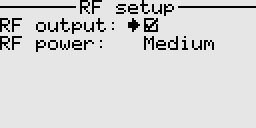

- **RF output:** Toggle the RF transceiver on or off. When enabled, an RF icon appears on the home screen. RF output is automatically disabled when switching to a different model for safety, thus it has to be re-enabled manually after changing models.
- **RF power:** Adjust the transceiver's transmission power. Higher power increases range but uses more battery.

## Sound

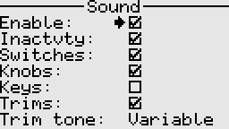

- **Enable:** Toggle all sounds on or off. When off, a mute icon appears on the home screen.
- **Inactivity:** Turn the inactivity alarm on or off. When enabled, a warning tone plays after a period without user interaction.
- **Switches:** Play a tone when any physical switch is moved.
- **Knobs:** Play a tone when a knob with a center detent is positioned at center.
- **Keys:** Play a tone when the physical UI buttons are pressed.
- **Trims:** Play a tone while trims are being adjusted.
- **Trim tone:** Set the trim tone behaviour. Fixed pitch (single frequency) or Variable pitch (changes with trim position).

## Backlight

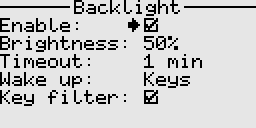

- **Enable:** Enables/disables the backlight. This may be useful for example to save energy on certain kinds of LCDs.
- **Brightness:** Controls the brightness level of the display. Higher brightness causes higher battery consumption.
- **Timeout:** Specifies the time before the backlight is turned off when the handset is inactive.
- **Wake up:** Specifies how the backlight is triggered on. Keys or Activity. When set to Keys, only the UI keys can wake up the backlight. Setting to Activity enables all the physical controls to wake up the backlight. This is useful when we want the backlight to stay on when operating a model, especially for LCDs that are not sunlight readable.
- **Key filter:** When enabled, the first key press only wakes the backlight without triggering any event in the User Interface. This setting is useful for LCDs that are not sunlight readable.

## Appearance

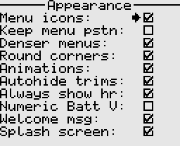

- **Menu icons:** Show or hide icons in the main menu.
- **Keep menu position:** Whether to remember the scroll position in the major menus (Main menu, System, Extras, etc.). This setting does not apply to context menus.
- **Denser menus:** Increases the number of entries shown in the major menus.
- **Round corners:** Turns on/off rounded corners in menus, dialog boxes, etc.
- **Animations:** Turns animations on/off for toast messages, loading spinners, etc.
- **Autohide trims:** Hides the trim bars on the home screen when the trims buttons are not being interacted with.
- **Always show hours:** Whether to always show the hours digits for timers.
- **Numeric battery voltage:** Replaces the graphical battery gauge with the actual voltage readout on the home screen.
- **Welcome message:** Turns on/off the "Welcome" message when starting up the handset. 
- **Splash screen:** Whether to show the user's custom splash screen during boot. See the "splash screen" folder for instructions on how to make a custom splash screen.

## Miscellaneous

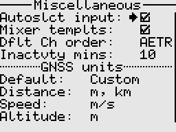

- **Autoselect input:** This enables automatic detection of the moved physical control when editing sources or switches, so that we can quickly select the desired control without having to scroll through the options.
- **Mixer templates:** Whether to enable the default mixer template when creating new models. Turning off this also removes the entry from the mixer context menu.
- **Default channel order:** Specifies the default channel order when creating new models. E.g., selecting AETR sends Ail to Ch1, Ele to Ch2, Thr to Ch3, and Rud to Ch4 in the mixer. The order can always be overridden in the mixer; this option is merely a time saving feature for new models.
- **Inactivity minutes:** How long before the inactivity event is triggered, specifically for the inactivity alarm.

# Advanced settings

This menu provides access to various advanced system settings. It is protected with a password (if set) to prevent unwanted configuration changes, for instance when we lend out the transmitter. 

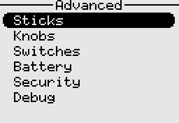

## Sticks

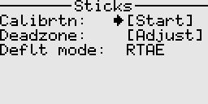

- **Calibration:** This starts the stick calibration process.
- **Deadzone:** This allows to adjust the center deadzone for the stick axes, without re-triggering full calibration.
- **Default mode:** This determines the default stick axis mapping for the Aileron/Roll, Elevator/Pitch, Rudder/Yaw, and Throttle inputs. It is essentially called "Stick mode" in other RC systems.

### Calibrating the sticks

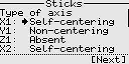
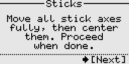
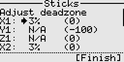

**Procedure:**
- Select the axis type: Self-centering (returns to the center), Non-centering or Absent.
- Move each stick axis through its full range. If an axis is self-centering, release it and let it return to center.
- Set the deadzone percentage. This applies around the center to prevent jitter when the stick is centered.

Properly calibrated stick axes always read between -100 to 100 when moved fully. If this is not the case, then redo the calibration, or check your hardware.  
  
How often you need to recalibrate the sticks depends on their build quality and how frequently you use the device. As a guideline, recalibrate:
- After any noticeable drift or inconsistent input.
- After major firmware updates or hardware changes.

## Knobs

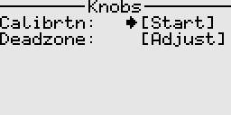

- **Calibration:** This starts the knob calibration process.
- **Deadzone:** This allows to adjust the center deadzone for the knobs, without re-triggering full calibration.

### Calibrating the knobs

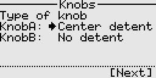
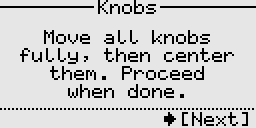
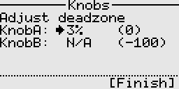

**Procedure:**
- Select the knob type: Center detent (mechanical stop at center), No detent, or Absent.
- Rotate each knob through its full range. If a knob has a center detent, return it to the detent position.
- Set the deadzone percentage. Deadzone is applied around the center to prevent jitter when the knob is centered.

Properly calibrated knobs always read between -100 to 100 when moved fully. If this is not the case, then redo the calibration, or check your hardware.

## Switches

This screen allows the user to specify the type of switches they have installed. Supported types are 2 position, 3 position, and their momentary variants. A frequent question is "How about push buttons?". Well, they are actually 2 position momentary switches.

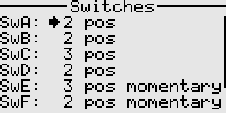

## Battery

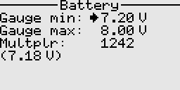

- **Gauge min and max:** These determine the range of the transmitter battery gauge. The minimum value also serves at the alarm threshold value, below which a low battery warning is shown. 
- **Multiplier:** This specifies the calibration factor for the transmitter battery voltage.

### Calibrating the battery gauge
To calibrate the battery gauge, use a digital multimeter to measure the actual battery voltage at the terminals. Then adjust the multiplier until the displayed voltage on the transmitter matches what the multimeter is showing. 

## Security

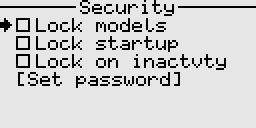

- **Lock models:** Locks the model manager screen, preventing access to the models.
- **Lock startup:** Locks the main menu on startup, effectively preventing changes to all settings (both model and system), unless the correct password is entered.
- **Lock on inactivity:** Locks the main menu after the system has been idle for the specified inactivity minutes. This setting applies only while the home screen is being displayed.
- **Set/Change password:** Opens the text edit dialog to edit the password. To remove the existing password, simply clear the field. Setting a password also protects the Advanced system menu.

## Debug

The Debug menu contains options intended primarily for troubleshooting, development, testing, and debugging.

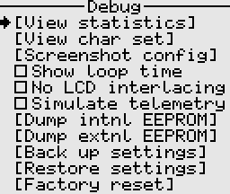

## About

The About menu provides information regarding firmware version, legal notices, credits, and support/contact resources.

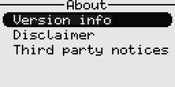

---

Back to [user guide](user_guide.md).