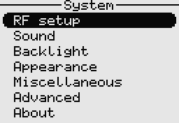

# System settings

The system menu offers comprehensive configuration options, allowing users to tailor the system to their needs.  
Entries are thoughtfully organized into categories for easy navigation and quick access to the desired settings. 

