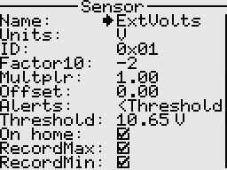
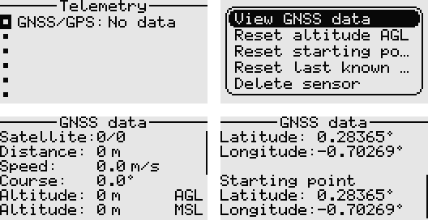

# Telemetry

## General telemetry
The receiver has built-in basic telemetry i.e external voltage, rssi, and packet rate. To measure other paramaters, you will need to build custom sensors and extend the receiver firmware to support these.  
Telemetry values are transmitted as 16-bit signed integers.  
To quickly mute/unmute telemetry alarms, long press the Down key on the home screen.

<p align="left">

</p>

### Fields
- Name: The sensor name.
- Units: The units of measurement.
- ID: This is the sensor ID, which must be unique. However, the same ID can be used for example to display a value in multiple ways.
- Factor10: The raw value is multiplied by 10 to power this factor.
- Multiplier: The raw value is multiplied by this number. Useful when we want to scale the value.
- Alerts: This parameter specifies how the alarm behaves.
- Threshold: This is the value below or above which the telemetry alarm will be sounded. The telemetry value will also flash when in alarm state.
- On home: Whether to automatically show the telemetry sensor on the home screen.
- Record max, and record min: Whether to track the max/min values received from the sensor. Useful 
for simple stats. Note that max and min are sensitive to outliers hence the filtering and smoothing
should be done before sending the telemetry to the transmitter.

## GNSS telemetry
The system also supports GNSS telemetry. A premade template is used to add the GNSS sensor to the telemetry screen.  
The receiver directly connects to the GNSS/GPS module via serial (UART), and handles parsing of the NMEA sentences 
as well as data conversion. GPS, GLONASS, BeiDou, Galileo are supported.  
The system remembers the last known location in case of a lost model, even when the transmitter is powered off.

<p align="left">

</p>

The structure below is used to send the GNSS telemetry data to the transmitter.

```c
typedef struct {
  int32_t  latitude;     //in degrees, fixed point representation; 5 decimal places of precision 
  int32_t  longitude;    //in degrees, fixed point representation; 5 decimal places of precision
  int16_t  altitude;     //Mean Sea Level altitude in meters, fixed point representation; 0 decimal places of precision
  uint16_t speed;        //speed over ground in m/s, fixed point representation; 1 decimal places of precision
  uint16_t course;       //course over ground in degrees, fixed point representation; 1 decimal places of precision
  uint8_t  positionFix;  //position fix indicator
  uint8_t  satellitesInUse;  //number of satellites in use
  uint8_t  satellitesInView; //number of satellites in view
} gnss_telemetry_data_t;
```
