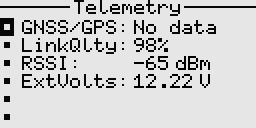

# Telemetry

## General telemetry
The receiver has built-in basic telemetry i.e. external voltage, RSSI, and packet rate. 
To measure other parameters, you will have to build custom sensors and extend the receiver firmware to support these.  
Telemetry values are transmitted as 16-bit signed integers.  
To quickly mute/unmute telemetry alarms, long press the Down key on the home screen.

### Fields
- Name: The sensor name.
- Units: The units of measurement.
- ID: This is the sensor ID, which must be unique. However, the same ID can be used for example to display a value in multiple ways.
- Factor10: The raw value is multiplied by 10 to power this factor. Useful when we want to scale the value.
- Multiplier: The raw value is multiplied by this number. Useful when we want to scale the value.
- Alerts: This parameter specifies how the alarm behaves.
- Threshold: This is the value below or above which the telemetry alarm will be sounded. The telemetry value will also flash when in alarm state.
- On home: Whether to automatically show the telemetry sensor on the home screen.
- Record max, and record min: Whether to track the max/min values received from the sensor. Useful 
for simple stats. Note that max and min are sensitive to outliers hence the filtering and smoothing
should be done before sending the telemetry to the transmitter.

## GNSS telemetry
GNSS telemetry is also supported. A premade template is used to add the GNSS sensor to the telemetry screen.  
The receiver directly connects to the GNSS/GPS module via serial (UART), and handles parsing of the NMEA sentences 
as well as data conversion. GPS, GLONASS, BeiDou, Galileo are supported.  
The system remembers the last known location in case of a lost model, even when the transmitter is powered off.

### Fields
- Satellites: The number of satellites in use / in view. "Fix" is appended when we have a position fix.
- Distance: The calculated distance between the model's current location and the home location (starting point). 
If the displayed distance is inaccurate, simply reset the starting point from the context menu. 
- Speed: The current speed over ground in metres per second. Defaults to 0 when there is no incoming telemetry.
- Course: The current course over ground in degrees. Defaults to 0 when there is no incoming telemetry.
- Altitude AGL: The altitude above ground level in metres. If the value is innacurate, reset it from the context menu.
- Altitude MSL: The altitude relative to mean sea level in metres.
- Latitude and Longitude: The location coordinates of the model. 
Displays the last known location when there is no incoming telemetry.
- Starting point: Displays the coordinates of the home location.

Note:
If different units of measurement are desired, use the provided GNSS sensor sub-templates (speed, distance, altitude) and change the multiplier and units.
