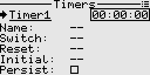

# Timers
Timers are used to time events, etc. The system provides up to 3 programmable timers.  
Timers can be configured to count up or count down.  
In count down mode, an audible alarm is played when the timer reaches zero. The timer continues to count with a negative sign.

## Fields
- Name: A name for the timer, otherwise a generic name is used.
- Switch: The control switch used to start and stop the timer. This is optional, as the timer can also be started or stopped from the context menu.
- Reset: The control switch used to reset the timer. This is optional, as the timer can also be reset from the context menu.
- Initial: The initial time if a countdown timer. If not specified, the timer will count up. A time picker dialog is used to easily set the initial time.
- Persist: Whether the timer is persistent i.e. if the value should be remembered between sessions.

## Examples

- [Stopwatch operated by a single momentary switch](./logical_switches.md#section_id_stopwatch_with_momentary_switch)  
- [Throttle timer - simple](./logical_switches.md#section_id_throttle_timer_simple)  
- [Throttle timer - advanced](./logical_switches.md#section_id_throttle_timer_advanced)  
