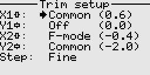

# Trim setup

Available states are as follows.
- Common: Applies the same trim value across all flight modes.
- F-mode: Applies independent trim settings for each flight mode.
- Off:    Trim is disabled globally for this axis, for example when we do not want trim on the throttle.

The Step setting determines how fast and how fine the trims move. Available options are Coarse, Medium, and Fine. 

---

Back to [user guide](user_guide.md).